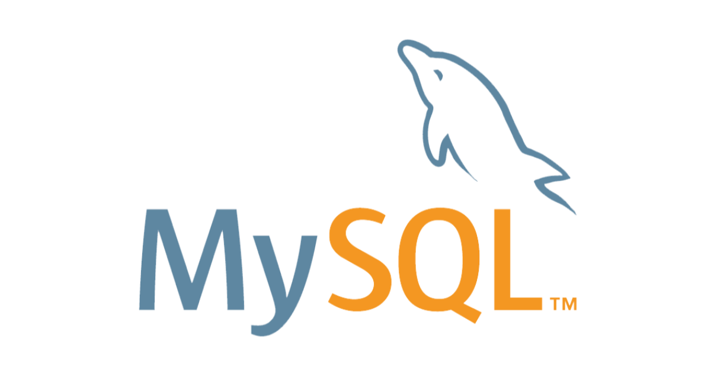

## Biseo 개발을 마치며

비서의 개발 과정은 2023/06/28 부터 2023/08/28 까지 2개월에 걸친 개발 과정이었다. 처음으로 PM 역할을 맡아 하나의 프로젝트가 바닥부터 끝까지 개발되어 가는 과정을 직접 조율하였고, 그 과정에서 배운 많은 것들을 이 게시물에 기록하고자 한다.

## 개발의 시작

Biseo의 개발은 기존 Biseo v1.0의 결함으로 인해 시작하게 되었다. 정돈되지 않은 코드, 관리되지 않는 DB 무결성과 확장성이 부족한 코드와 디자인으로 인해, 다양한 Edge 케이스에서 오류를 발생 시켰고, 사용함에 어려움을 주었다. 이를 위해선 대대적인 코드의 수정이 필요했으나, 선배의 제안으로 스택과 코드 스타일을 바꾼 새로운 버전의 개발에 돌입하게 되었다.

## 2022 겨울 학기

가장 먼저 진행한 것은 스타일 기획이었다. 어떤 방식으로, 어떤 와이어프레임을 가지고 작동할 것인지 자세히 기획하고, 이 당시에는 팀에 디자이너가 없었기 때문에, 개발자들이 각자의 아이디어와 디자인 컨셉을 제시하고 그에 대한 Figma 스케치를 진행했다. 기초적인 개발 환경의 구현과 정비를 진행했고, 새로운 기능성과 기대 방향에 맞추어 새로운 스택을 도입했으며, 구체적인 기획과 더불어 API 명세를 작성하는 작업을 이어갔다. \
이후로 이어졌던 작업은 세부적인 규칙, 이하 Policy의 정립이었다. 어떤 정보를 클라이언트에게 제공하고 어떤 정보를 숨길지, 어떤 방식의 인터렉션을 진행하고 UX를 정돈할지에 관한 논의가 중요하게 이어졌다. Biseo 서비스는 동아리 내부의 채팅 및 투표에 관한 서비스이기 때문에 클라이언트 딴에서 접근할 수 있는 정보의 통제가 매우 중요한 프로젝트였다. 또한, 단순한 접근 뿐만 아니라 통신된 패킷을 열어서 접근할 수 있는 정보도 제한하여야했기 때문에, 클라이언트에서 얻을 수 있는 정보를 최소화하여 서버의 Load를 늘리게 된 경향이 있었다.\
이로 인해 추후 백엔드 코드와 로직을 구현할때 쿼리의 효율성을 많이 고려하게 되었다. 실제로 가장 잦은 리팩토링을 거치게 된 코드가 Agenda, 즉 투표 항목에 대한 쿼리 부분이었다.

초기에 개인적으로 구상했던 Biseo v2.0의 프레임 워크. 지금과는 디자인도 기능도 많이 다르다.

### 새로운 스택

이 프로젝트를 하기 전까지는 스택 이라는 개념에 대하여 큰 감흥이 없는 상황이었다. 당장 배운 것만 활용하기에도 능력이 부족했고, 다양한 것을 경험하고 그 장단점을 파악할 능력은 더더욱 부족했다. 그러나 운이 좋았는지 정말 우연히 이 프로젝트와 병행하여 학부 강의 중 데이터베이스개론(이하 디비개)라는 이름의 강의에서, 다양한 DB의 종류와 특징, 사용 방법에 대하여 배우게 되는 기회가 되었다 (김명호 교수님께 감사를 드립니다). \
그 강의에서는 처음으로 MongoDB와 같은 비관계형 DB를 벗어나서 MySQL과 같은 관계형 DB를 접할 수 있었는데, 비관계형 DB에서도 무결성 관리에 주의를 기울인다면 관계형 DB를 모방할 수 있다고 생각했으나, 그 주의를 기울이지 않게 하면서 필요로하는 쿼리문의 기능성과 효율성을 확보할 수 있다는 점에서 관계형 DB를 사용한다는 사실을 배우게 되었다. 이는 전부는 아니겠지만 일부, 적절한 스택의 사용이 중요한 이유를 내포하지 않을까 생각하게 되었고, 다양한 스택에 관한 정보의 수집과 업데이트에 대한 중요성을 느끼게 되었다고 할 수 있겠다. \

이후 Biseo 프로젝트에 관계형 DB를 사용하게 된 것에 대해 이의는 없었다.

### API 명세

지난 2022 SPARCS 해커톤에서 뼈저리게 느꼈던 것이지만, 제대로된 API 명세가 존재한다면 백엔드의 작업은 훨씬 빠르고 수월하게 진행할 수 있을 뿐만 아니라, 분업과 작업의 모듈화도 어렵지 않게 진행할 수 있게 된다. 추후에 이 API 명세는 필요에 따라 조금씩 변화하며 불가피한 코드의 수정을 불러오기도 했으나, 이는 큰 문제가 아니었다.
API 명세에는 Socket, HTTPS 통신 뿐만 아니라 각 변수의 타입, DB 스키마의 구조 및 타입까지 선언하여 정리하여야 했다. 이 작업은 추후에 알게 되었지만, Zod 패키지를 사용한 것으로 보인다.

## 2023 봄학기

2023년의 봄학기는 여러모로 바빴던 탓에 Biseo v2.0 개발에 집중하기 쉽지 않았던 시기였다. 악명이 높은 운영체제 및 실험 강의를 수강하는 동시에 Pintos를 개발하고 각종 전공 강의에 집중해야하는 시기였던 이유였다. 하지만 동시에 나에게 Biseo가 중요했던 까닭은, 처음으로 정규 학기에 PM으로서의 역할을 해야했던 것이다. \
여태까지 동아리에서 개발을 해 온 경험은, 나와 PM 선배 단 둘이서 Biseo 서비스를 유지 보수하는 과정이었기 때문에 6명으로 늘어난 팀을 이끌어갈 때 어떤 일을 해야 하는지 결정하는 것에 어려움을 많이 겪었다. 기존에는 열심히 작성하지 않던 회의록을 작성하고, 온보딩 계획이 잡혀있지 않은 프로젝트에서 5명의 사람들을 프로젝트에 적응을 시키며, 각자의 역할을 분담하여 새로운 기능의 개발을 통해 코드의 구조에 익숙해지도록 하는 과정을 주로 거치며 최선을 다했던 것으로 기억한다. 전부 이전까지 2명짜리 팀에서 PM을 맡은 선배에게서 배운 것들이지만, 오랫동안 훌륭한 프로젝트를 일구기 위한 일이라기 보다는 단기적으로 공부를 하고 경험을 쌓기에 더 좋은 운영 방식이 아니었나 생각이 조금 들었다. \
우선 학기가 시작하기 전부터 2023 봄학기가 끝난 후 여름 학기에는 Biseo v2.0의 완성을 계획하고 있었기 때문에 시간의 대부분을 온보딩 혹은 Biseo 기능 자체에 대한 적응에 초점을 맞춘 것 같다. 바쁜 환경과 무지함으로 인해서 PM의 역할을 온전히 수행하지 못한 것에 대해서는 아쉬움이 따르지만, 여름 학기에 훌륭하게 개발에 임하고 따라준 팀원들을 생각하면 결과론적으로는 나쁘지 않은 선택이었다고 생각한다.

## 2023 여름학기

봄학기가 끝나고 여름 학기로 넘어가는 시기에서 나는 PM으로서, 그리고 개발자로서 Biseo v2.0의 개발을 동아리의 많은 사람들에게 홍보하기 시작했다. 봄학기에 함께하던 한명의 개발자가 하차를 하였지만 또 다른 개발자 둘과 디자이너 한 명이 합류하면서, 총 8명의 인원으로 2달간의 본격적인 개발을 시작하게 되었다. \
이 기간동안 나는 PM으로서의 역할을 잘 수행했다기 보다는 PM이 해야할 일에 관해 정말 많은 것을 배우게 된 것 같다. 가끔씩 생겼던 의견 충돌이나 의사 결정, 진행상황 조율등의 역할은 맡을 수 있었으나, 어떤 일이 어떤 시기에 이루어져야 하는지에 대해서는 무지했던 만큼, 개발자로 합류했던 선배의 도움을 많이 받게 되었다.

### PM의 역할

PM은 기본적으로 개발자로서의 역할보다, 개발 프로세스 자체의 촉매의 역할을 한다고 느꼈다. \
개발을 시작하기에 앞서 어떤 시기에 어떤 작업이 완료 되어야 하는지를 계획하며 타임 테이블을 작성하고, 각자의 강점 혹은 관심사, 가장 높은 효율을 내는 페어를 파악하여 묶어주는 과정이 필요했다. 이 과정에서 2개월이라는 짧은 시간 동안 진행되어야 할 일들에 대해 병렬적으로 진행될 수 있도록 계획을 차리고, 의존성을 가지는 업무는 순서를 정했으며, 스택에 관한 공부부터 배포 및 테스트의 과정까지 계획을 마칠 수 있었다. \
그 이후 진행된 일은 각자의 진행 상황에 대한 빠른 공유와 상황 조율이었다. 기본적으로 Biseo v2.0 프로젝트는 일주일 간격의 정기적인 회의와 상황 재조정으로 이루어졌는데, 이는 2개월, 즉 8주간의 프로젝트에겐 너무 긴 주기였다. 이 때문에 모든 과정의 중앙에서, 각 인원들의 진행 상황이 어떻게 이루어지는지 이해를 하고, 할당된 업무를 마친 인원을 아직 어려움을 겪는 인원에게 재배정해주는 작업이 주를 이루었다.
이 과정에서 PM의 할 일이 바뀐 시점은 하나의 페이즈가 마무리된, 많은 개발 방식과 구획화가 재배치되는 시점이었다고 생각한다. 나와 같은 경우에는, 백엔드의 개발이 마무리되고 모든 인원이 프론트 엔드 개발에 착수할 때였다. 각각의 인원들이 병렬적으로 작업이 진행되기 위해서는 개발 대상을 독립적으로 분리할 필요가 있었는데, 이 과정에서 Atom, Molecule, Organism, Page의 크기 순서로 컴포넌트를 분리하여 개발을 진행하는 방식이 매우 효율적이라는 것을 배우게 되었다. Box, Text, Button과 같이 매우 기초적이고 분해가 불가능한 컴포넌트를 소수 인원이 빠르게 개발을 끝 마치고, 나머지 인원이 그것들로 이루어진 큰 컴포넌트들을 개발해 나가는 방식으로 진행을 하니 수평적으로 UI 개발을 분업하는 것보다 효율적으로 작업이 가능했고, 이때 PM의 역할은 각자가 개발하는 컴포넌트가 중복되지 않는지, 또한 발견되지 않았지만 자주 반복되어 사용되는 Atom 혹은 Molecule이 존재하지는 않는지 점검하는 역할이 되었을 것이다. \
기초적인 UI가 구색을 갖추었을 때, 프로젝트는 본격적으로 구현 테스트가 가능해지기 시작한 수준에 이르게 되었다. 각각의 페이지에 Route를 연결하고, UI를 렌더링할 수 있게 되자 다양한 버그와 문제점들이 눈에 들어오기 시작했고, 단순한 구현 뿐만 아니라 적극적인 이슈 해결이 필요해지기 시작한 것이다. 이에 위해서 팀은 Github Issue의 사용을 도입하게 되었다. 기존까지는 각자가 맡아야하는 컴포넌트에 대해서 Branch와 PR을 생성하며 리뷰를 통해 Approve된 PR만 Merge 하는 방식으로 진행되었지만, Github Issue를 통해서 더욱 능동적인 이슈 해결이 가능해지기 시작했다.

### 좋은 개발이란

유능한 사람들 가운데에서 개발을 진행하다 보면, 다른 사람들보다, 그리고 PM의 기대보다도 더 많은 것을 시도하고 이뤄내고자 하는 사람들이 생기기도 한다. PM의 역할이 프로젝트의 효율적인 진행과 성과에 집중한다고는 하지만, 한 사람이 많은 일을 독단적으로 기획하거나 추진하는 경우가 생기는 경우도 있다. 나는 팀원의 의견을 대부분 수용하는 방향으로 일을 진행했고, 거절 혹은 쓴 소리를 잘 하지 못하는 경향이 있었지만, 가끔은 과장된 기획으로 이어질 수 있는 소수의 추진력을 줄여나갈 수 있는 방향의 리더십도 필요함을 느꼈다. 추진력이나 자신감이 부족한 사람에게는 필요한 용기를, 절제와 Upper Limit이 필요한 사람에게는 적절한 제동이 필요함을 느끼게 되는 경험들이 생겼다. 이 또한 개발자 경험이 많은 선배가 없었더라면 쉽지 않았을 일이었다.

### 개발의 막바지

개발의 막바지에 이르러서는 시간과의 싸움이 되었던 것으로 기억한다. 많은 개선점과 문제 상황이 발견되었으나 우리는 당장 개강 직후 사용하게 될 Biseo 서비스가 필요했던 만큼 UI 버그 혹은 치명적인 로직 결함을 해결하는데 많은 시간을 할애했다. 이때 PM의 역할은 크게 이슈 리스트 작성, PR 리뷰, 그리고 이슈 중요도 판별 및 할당 정도의 업무만이 있었다. 정말 다양한 곳에서 버그가 발생하고, 각 인원이 지금까지 작업했던 내용들도 모두 다르기 때문에 각자의 경험이 많은 곳에서 능력을 살릴 수 있는 업무 분배가 많이 이루어졌다. 다행히도 그중 가장 Biseo 서비스에 대한 경험이 많았던 사람이 나였기 때문에, 다양한 종류의 이슈들을 골고루 해결하면서 더 통찰을 키울 수 있었다. \
아쉽게도 난 서버 관리나 배포에 관련된 지식이 없었기 때문에 배포 과정에서 많은 것을 배울 수는 없었다. 다만 기존에 사용하던 npm과 yarn에서 패키지 관리의 효율성을 위해 pnpm으로 변경하는 등, 패키지 관리 시스템의 종류도 스택만큼이나 조정할 필요성이 항상 존재한다는 사실을 접하게 되었다.

### 개발을 마치며

개발을 마치며, 2023-09-08, 8명의 팀원과 비대면 회고를 하는 시간을 가졌다. 학기가 시작되어 바쁜 사람들, 교환 학생의 기회를 잡아 멀리 떠난 사람과 일자리에서 최선을 다 하는 사람들이 다들 모여 프로젝트에 대해 감명이 깊었던 것과 감사했던 점에 대하여 이야기를 나누게 되었다.\
사실 이 회고록 또한 회고 시간을 가진다는 공지를 본 후 작성하는 것이기 때문에, 마지막으로는 회고의 필요성에 관해 강조하고 싶다. 하나의 프로젝트 혹은 큰 산을 넘어가고 난 후에는 많은 사람들의 긴장이 풀리고 과거 경험이 희석되는 순간이 다가오게 된다. 이 시기에 한번 더 지나오면서 해온 일들, 그리고 앞으로 해 나갈 일에 대하여 정리하게 된다면 한번 만들어진 경험은 쉽게 사라지지 않을 것이다.\
마지막까지 PM으로서, 혹은 전 PM으로서 정말 귀한 경험을 얻어가게 되었다. 지난 시간동안 나를 따라와주고 또 이끌어준 팀원들에게 감사할 따름이다.
